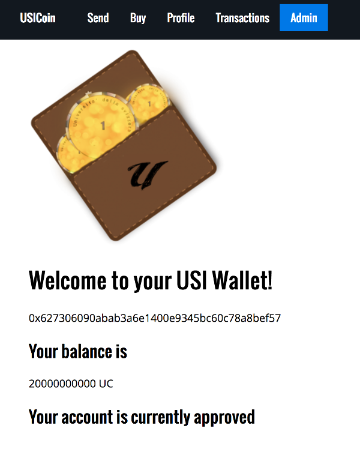
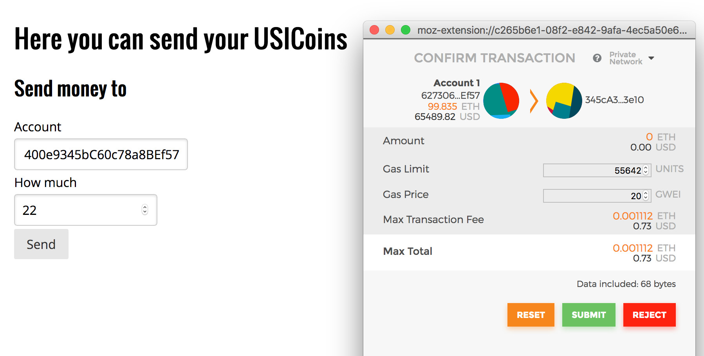

## USICoin

Group project for the Distribed System course @ USI 2017-2018.

USICoin is an Ethereum token thought to be used inside the University of Lugano.

This repository contains the ethereum token and the web wallet application.

Technologies:

BlockChain (Smart Contracts)

Webpack(React)

Truffle

Metamask

Parity

## SETUP:

0. run >truffle develop to create a private blockchain the default port is 9545

1. Use >truffle compile from terminal on this folder

2. run >truffle migrate (eventually truffle migrate --reset)

3. npm run start (eventually npm install)
